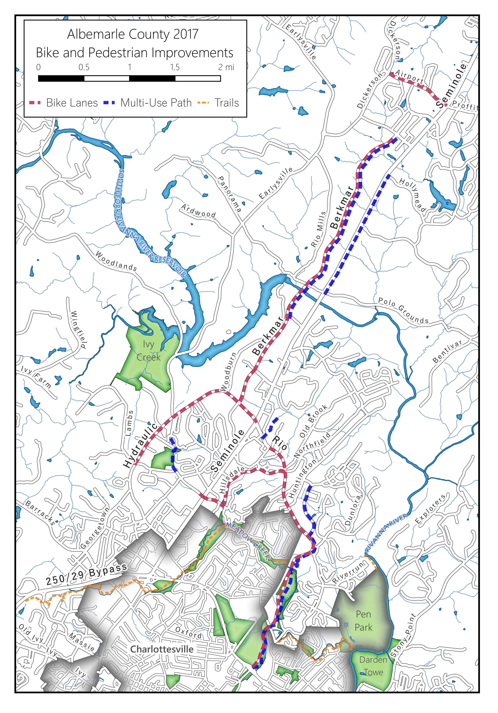
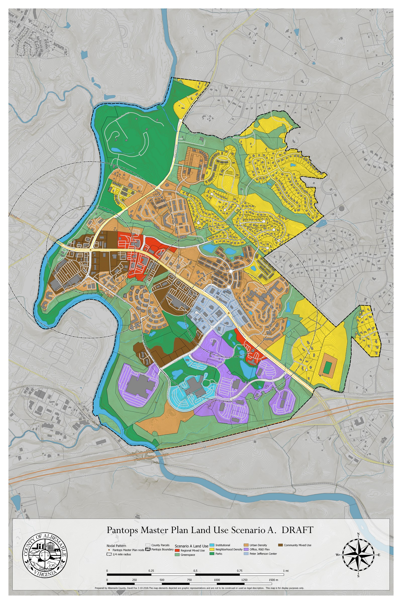
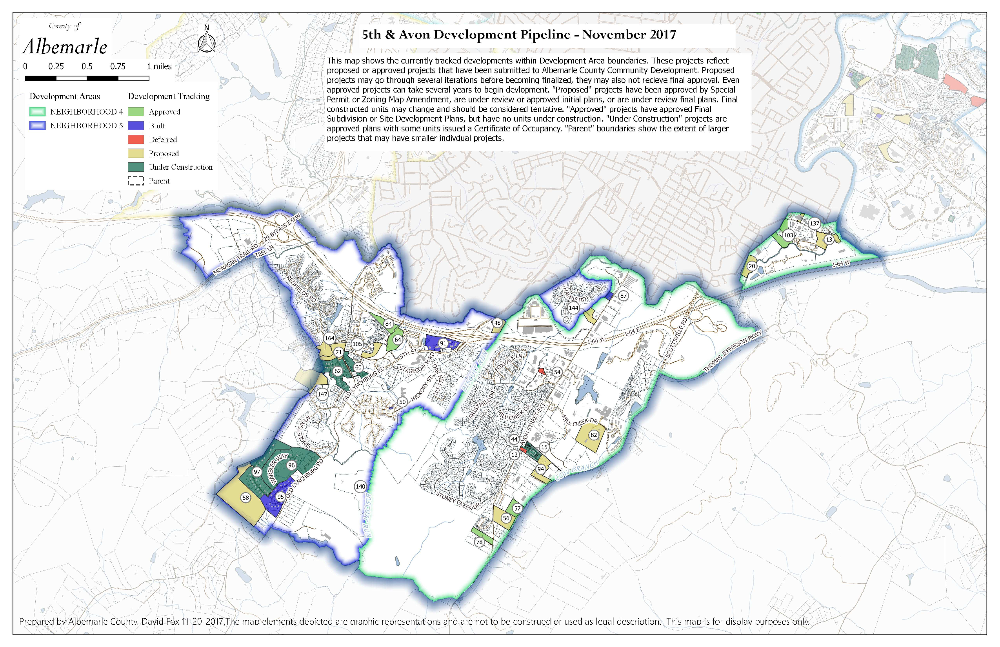
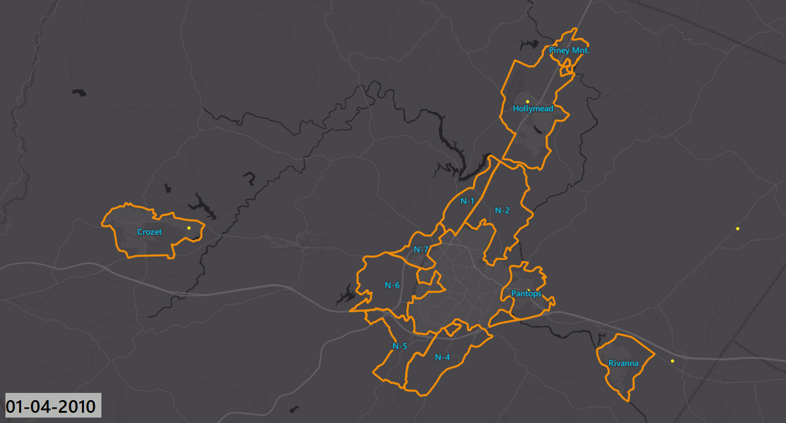

```{r setup, include=FALSE}
knitr::opts_chunk$set(echo = FALSE)
```

## Albemarle Planning Department  
  
After graduate school I worked for the Albemarle County Planning department. I did  general cartographic work, like this map for the annual report on new trail connectivity.

```{r, layout="l-body-outset", fig.height=4}

```

I was also part of the team revising the master plan for the Pantops Neighborhood, east of Charlottesville. This involved evaluating things like traffic and car accidents.

```{r, layout="l-body-outset", fig.width=6}
knitr::include_graphics("images/volume-crashes.jpg")
```

When doing master planning, you gather extensive amounts of public comments - few things hone your appreciation of clear map design than making a map and then having to plunk it down on a table in front of an audience - potentially a hostile one.

```{r,layout="l-body-outset", fig.width=6 }

```

```{r, layout="l-body-outset", fig.width=4}
knitr::include_graphics("images/pantops_meet.png")
```

I also developed a series of maps tracking residential development - a hot topic in the County, which was growing rapidly.

```{r, layout="l-body-outset", fig.width=6}

```
This animation was developed for a join presentation with the Board of Supervisors and the School Board. It was paced so that I could give a narrative of the unfolding pattern of development during the presentation.  

```{r, layout="l-body-outset", fig.width=6}

```
