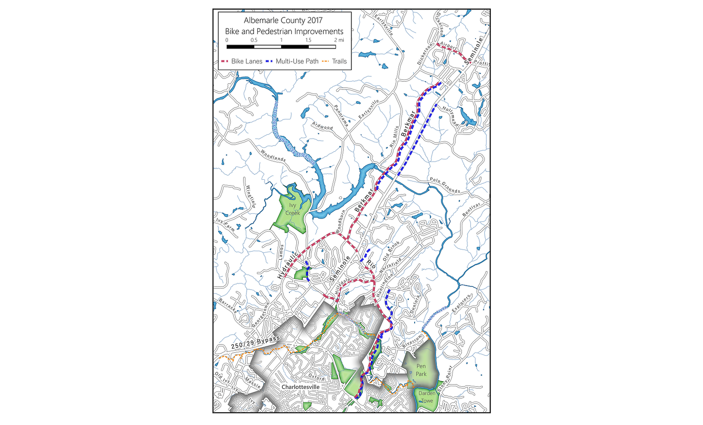

```{r setup, include=FALSE}
library(knitr)
knitr::opts_chunk$set(echo = FALSE, layout = "l-body-outset")
```

### [Bike and Ped](https://github.com/davidnfox/portfolio/blob/main/bike_ped.jpg?raw=true)
```{r}

```

### [Development Pipeline](https://github.com/davidnfox/portfolio/blob/main/5th_Avon_pipeline.png?raw=true)
```{r}
knitr::include_graphics("https://github.com/davidnfox/portfolio/blob/main/5th_Avon_pipeline.png?raw=true")
```

### [Development pattern GIF](https://github.com/davidnfox/portfolio/blob/main/weekly_150.gif?raw=true)
```{r}
include_graphics("https://github.com/davidnfox/portfolio/blob/main/weekly_150.gif?raw=true")
```

### [Traffic Analysis](https://github.com/davidnfox/portfolio/blob/main/volume-crashes.jpg?raw=true)
```{r}
include_graphics("https://github.com/davidnfox/portfolio/blob/main/volume-crashes.jpg?raw=true")
```

### [Master Planning](https://github.com/davidnfox/portfolio/blob/main/ScenarioA.jpg?raw=true)
```{r}
include_graphics("https://github.com/davidnfox/portfolio/blob/main/ScenarioA.jpg?raw=true")
```
